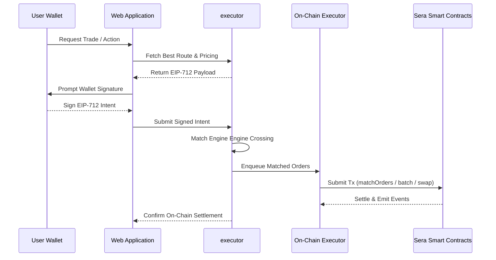
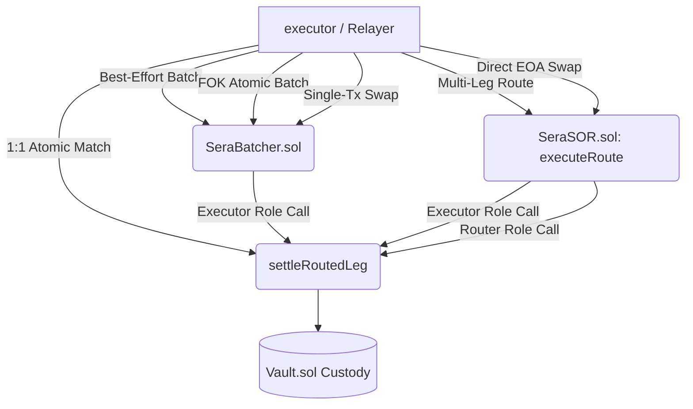

# Sera integration Integration Architecture

Sera is explicitly designed to be paired with an off-chain executor and an automated Executor/Relayer. This hybrid architecture extracts the high-performance intent matching capabilities found in Centralized Exchanges (CEX) while relying on non-custodial cryptographic settlement on-chain.

## High-Level Execution Flow

## Contract Execution Environments
The Sera protocol utilizes a modular wrapper architecture. Depending on the action identified by the executor, the relayer submits to different execution wrappers, all of which funnel down into the core engine.

### Implicit Vault Rebates
When trades execute with a physiological spread (i.e. Taker provides more than Maker expects), the Sera engine internally computes the split (e.g., Maker vs. Taker vs. Protocol). Critically, `Sera.sol` enforces these splits via **implicit mathematical rebates** instead of explicit token pushes. The matching engine calculates the final required payout, and pulls exactly that updated minimum from the sender's Vault balance, natively protecting Vault solvency while saving gas.

## Off-Chain Requirements
1. **Nonce & UUID Management:** The smart contract natively strictly enforces `isIntentExecuted[hash]` for instant withdrawals, and `filledAmount` trackers for trades. Your off-chain system should deterministically construct UUIDs to prevent users from accidentally signing the same intents via frontend retries.
2. **Execution Timing:** All limits have standard `expiration` timestamps. Relayers must ensure they submit batches to the mempool comfortably prior to this expiry window.
