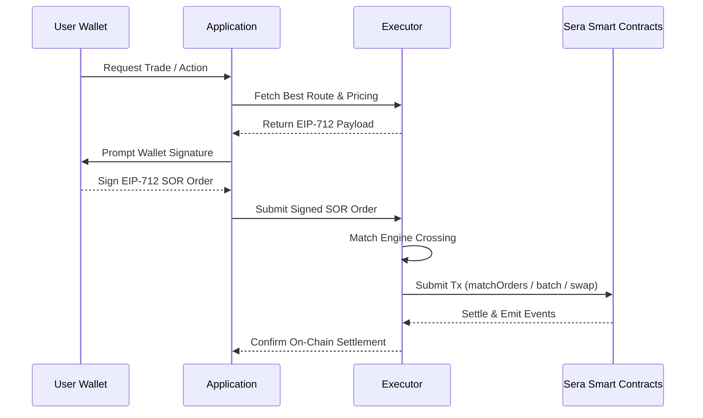
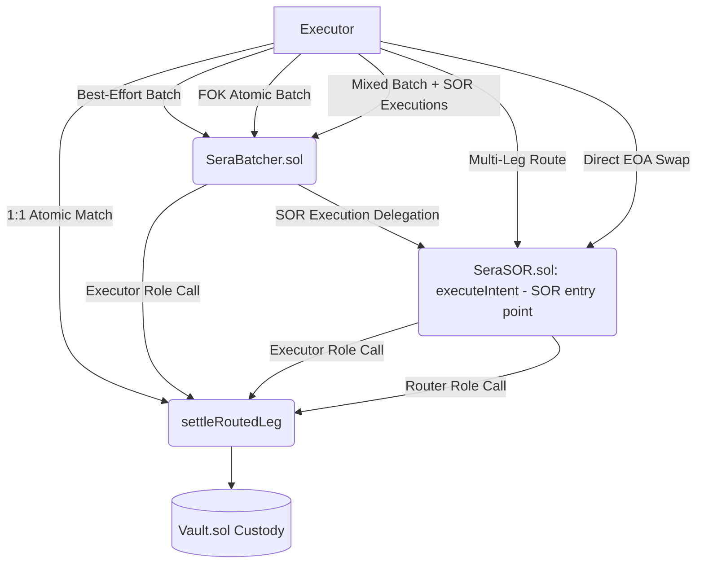

# Sera Integration Architecture

Sera is designed to be paired with an off-chain executor that submits matched orders on-chain. This hybrid model enables high-performance order matching off-chain while keeping settlement and custody fully on-chain and non-custodial.

## High-Level Execution Flow

## Contract Execution Environments
Sera utilizes a modular wrapper architecture. Depending on the action type, the executor submits to different execution wrappers, all of which funnel into the core engine.

### Implicit Vault Rebates & Pull Optimization
When trades execute with a physiological spread (i.e. Taker provides more than Maker expects), the Sera engine internally computes the split (e.g., Maker vs. Taker vs. Protocol). Critically, `Sera.sol` enforces these splits via **implicit mathematical rebates** instead of explicit token pushes.

For SOR (routed) settlement, this is further optimized:

1. **First-leg vault pull optimization:** `_settleRoutedLegInternal` computes `neededFromTaker = makerReceives + protocolTake0` and `transientPhysical = effectiveMatchAmount0 - takerVaultPull` *before* vault interaction, then pulls only the deficit from the vault. The taker's spread share (`spreadToTaker0`) remains in the vault implicitly — never transferred out and round-tripped back. If the transient physical tokens alone exceed the cost, any surplus is returned to the taker's vault via `safeTransfer` + `creditLedger`. This saves ~7k gas per vault-pulled leg.

2. **Sentinel surplus safety net:** For intermediate sentinel legs (tokens held in Sera from a previous hop), any non-zero surplus (`transientPhysical - neededFromTaker`) is returned to the taker's vault via `safeTransfer` + `creditLedger`. In the intended deployed flow, the executor pre-calculates exact `matchAmount1` values to ensure zero intermediate spread, making this block effectively dead code — but it prevents funds from being stranded in Sera.

3. **Executor invariant:** The executor guarantees that for every sentinel leg, `executionValue1 == resolvedSentinelAmount` (zero spread). Any accidental mismatch in a multi-leg chain ultimately triggers a `TransientBalanceNotZero` revert at route completion, enforcing strict conservation of funds.

## Executor Requirements
1. **Nonce & UUID Management:** The smart contract strictly enforces `isUuidExecuted[user][uuid]` for instant withdrawals, `isIntentUuidUsed[user][uuid]` for SOR executions, and `filledAmount` trackers for signature-checked trade legs. Routed taker intents are bounded by the signed SOR envelope plus `consumeIntentUuid()` replay protection rather than a persisted taker-side `filledAmount` counter. The executor should deterministically construct UUIDs to prevent users from accidentally signing the same SOR orders via interface retries.
2. **Execution Timing:** All limits have standard `expiration` timestamps. Executors must ensure they submit batches to the mempool comfortably prior to this expiry window.
3. **SOR Match Calibration:** For multi-hop routes, the executor must calculate each intermediate leg's `matchAmount1` such that `executionValue1 == resolvedSentinelAmount` for zero-surplus settlement. Failure to calibrate correctly will cause the route to revert with `TransientBalanceNotZero`.
